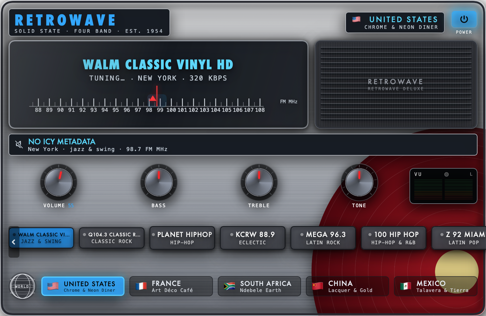
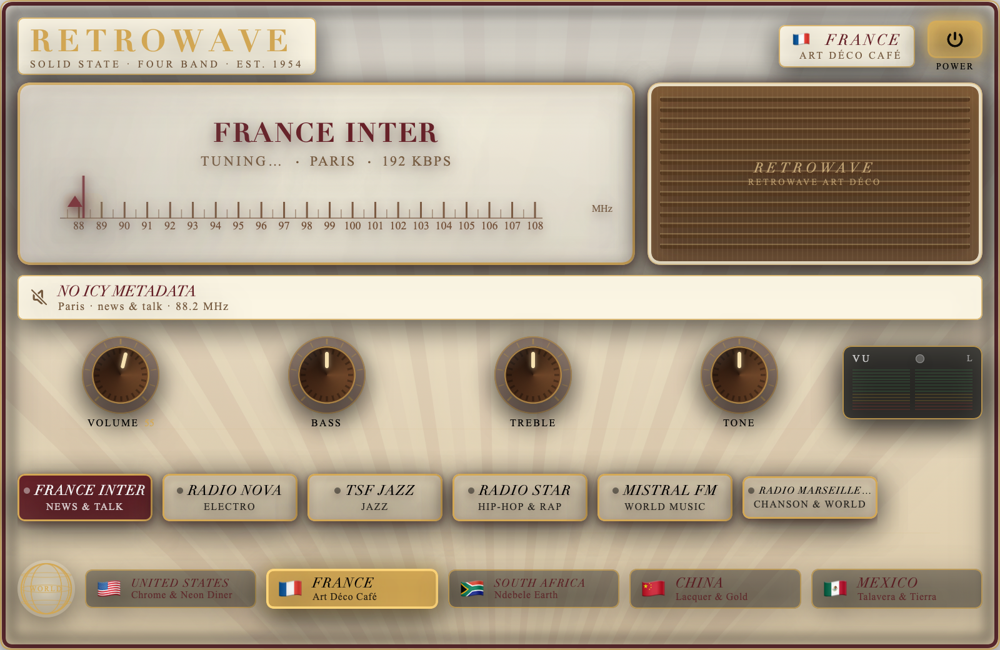
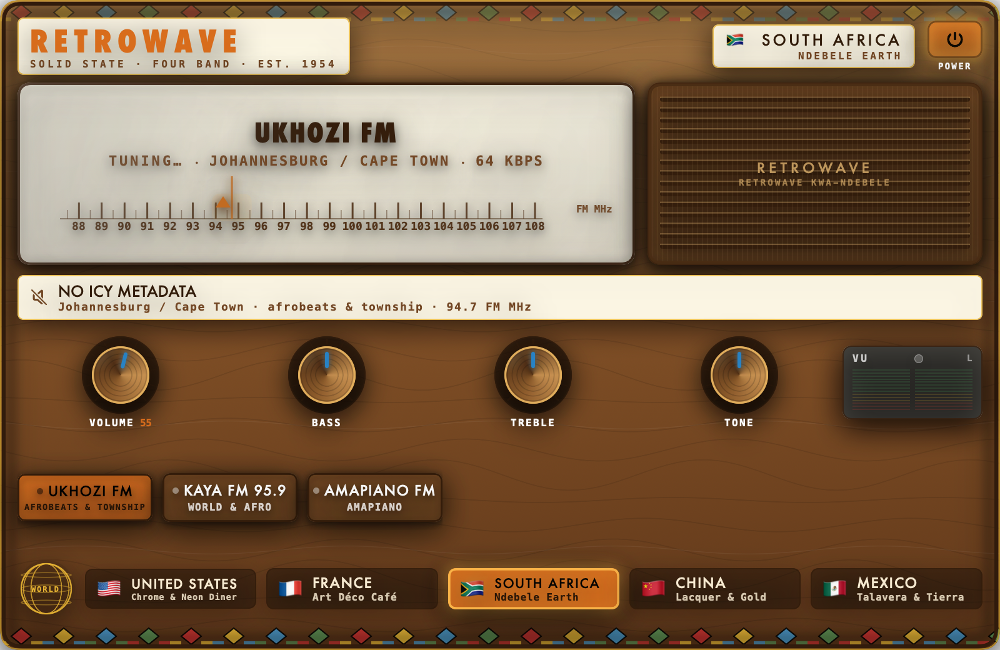
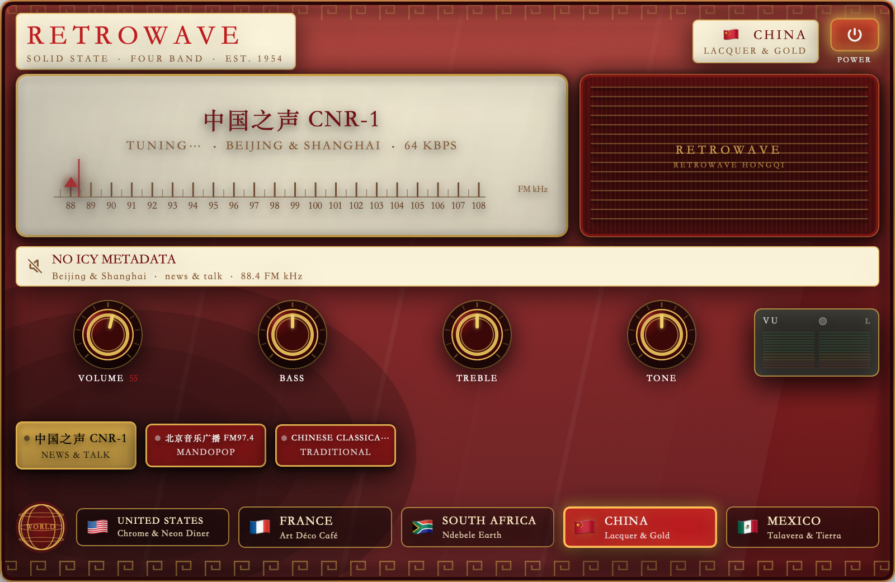
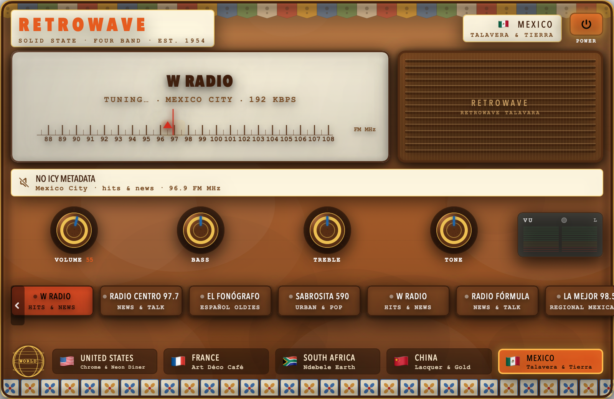

# RetroWave

A vintage-cabinet internet radio for macOS, built entirely with SwiftUI and
AVFoundation — no Xcode project, no asset catalog, no bitmap art. Every
texture is painted procedurally, and the app ships **five country skins**
and **31 live stations across 12 cities**, plus a 300×80 mini player.

<table>
  <tr>
    <td align="center"><b>Chrome &amp; Neon Diner</b> 🇺🇸<br></td>
    <td align="center"><b>Art Déco Café</b> 🇫🇷<br></td>
  </tr>
  <tr>
    <td align="center"><b>Ndebele Earth</b> 🇿🇦<br></td>
    <td align="center"><b>Lacquer &amp; Gold</b> 🇨🇳<br></td>
  </tr>
  <tr>
    <td align="center" colspan="2"><b>Talavera &amp; Tierra</b> 🇲🇽<br></td>
  </tr>
</table>

---

## Requirements

* **macOS 13 Ventura or newer**
* **Xcode Command Line Tools only** — the full Xcode app is *not* needed
  (there is no `.xcodeproj`; the bundle is assembled by hand):

  ```bash
  xcode-select --install
  ```

* The build is native to your machine: `build.sh` picks `arm64` or `x86_64`
  automatically from `uname -m`.

## Build & run

```bash
git clone https://github.com/nikthecrick/RetroWave.git
cd RetroWave
./build.sh              # → ./build/RetroWave.app (ad-hoc signed, ~30–40 s)
open build/RetroWave.app
```

Pass a directory to build elsewhere: `./build.sh /tmp/elsewhere`.

**First launch:** the app is ad-hoc signed, so Gatekeeper quarantines it.
Right-click → **Open**, or clear the quarantine flag:

```bash
xattr -dr com.apple.quarantine build/RetroWave.app
```

To install: `cp -R build/RetroWave.app /Applications/`

## Controls

| Control | Action |
|---|---|
| **POWER** | Toggles the set. Lit when on. (`⌘P`) |
| **Volume** knob | Real volume, 0–100, drives `AVPlayer.volume`. |
| **Bass / Treble / Tone** knobs | Rotate and hold state; cosmetic (`AVPlayer` exposes no EQ). |
| **Station pushbuttons** | Click to tune; click the live station to toggle power. |
| **◀ ▶ chevrons** | Page the station band (it also drags directly). |
| **Country buttons** | Switch skin — 0.6 s crossfade + a static crackle. |
| **MINI paddle switch** (header) | Slides the cabinet into the 300×80 mini bar (`⇧⌘M`); the mini bar's expand glyph brings it back. |
| **⌘] / ⌘[** | Next / previous station |
| **⌘Q** | Quit |

Last country, station and volume are restored on launch; the set always
starts in **STANDBY** (primed but off).

## Station data

`Models/stations.json` — sourced from the [radio-browser.info](https://www.radio-browser.info/)
open directory. Every URL was verified live (HTTP 200/206 with a real audio
body) before shipping. The app streams from the original servers and hosts
no audio itself.

Two honest caveats:

* A handful of community Icecast servers still serve plain **HTTP**, so
  `Info.plist` sets `NSAllowsArbitraryLoads`. Fine for a local build; a Mac
  App Store submission would need HTTPS-only streams.
* `frequency` values are **dial positions**, not licensed broadcast
  frequencies (they drive the needle on the printed 88–108 scale).

For deeper notes — how the streams were verified, what was rejected, and
every design judgement call — see [`NOTES.md`](NOTES.md).

## Rendering the skins offscreen (no GUI needed)

The offscreen renderer walks the real view hierarchy through `ImageRenderer`,
so it reproduces layout, typography and the procedural textures:

```bash
swiftc -parse-as-library $(find . -name '*.swift' -not -path './Tools/*' \
    -not -name 'RetroWaveApp.swift' -not -path './.build/*') \
    Tools/Preview/Preview.swift -o .build/preview
./.build/preview Models/stations.json .build/preview-out
# → .build/preview-out/skin-{US,FR,ZA,CN,MX}.png
```

## Regenerating the app icon

```bash
swiftc -O Tools/MakeIcon.swift -o .build/makeicon
./.build/makeicon Resources/AppIcon.iconset
iconutil -c icns Resources/AppIcon.iconset -o Resources/AppIcon.icns
```

## Project layout

```
RetroWave/
├── RetroWaveApp.swift          # @main App, menu commands, window sizing
├── build.sh                    # swiftc build + bundle + ad-hoc codesign
├── Models/                     # Country, Station, JSON station library
├── Audio/                      # AVPlayer wrapper (ICY, retry) + synthesized WAV FX
├── Skins/                      # SkinTheme + 5 procedural textures/knob materials
├── Views/                      # Cabinet, dial, knobs, VU, bands, mini player
├── Resources/                  # Info.plist, icon, icon source
└── Tools/                      # Icon + offscreen preview renderers
```
